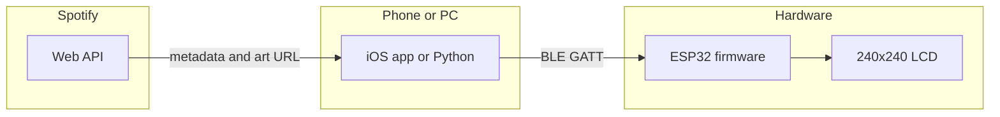

# Spotify Display

Monorepo **`spotify-display1`**: phone and desktop tools send **Spotify album art** to a custom **ESP32** device over **BLE**; firmware dithers to RGB565 and drives a **240×240** LCD. **Proof-of-concept** stack: **Swift / Python**, **Spotify Web API**, **embedded C++**, and a versioned **BLE** contract in [`docs/BLE_PROTOCOL.md`](docs/BLE_PROTOCOL.md).



## Stack

| Part | Tech |
|------|------|
| Firmware | PlatformIO, Arduino, ESP32-S3, ST7789-class display |
| Desktop | Python 3, Bleak, Spotipy, ImageMagick (Wand) |
| Mobile | SwiftPM executable, SwiftUI, CoreBluetooth, Spotify OAuth (PKCE-style flow in app) |

## Repository layout (`spotify-display1`)

| Path | Purpose |
|------|---------|
| [`src/main.cpp`](src/main.cpp) | ESP32 firmware (display, SD cache, BLE server) |
| [`platformio.ini`](platformio.ini) | PlatformIO board env, flash/monitor ports |
| [`python/spotify_album_sender.py`](python/spotify_album_sender.py) | Desktop BLE + Spotify sender |
| [`python/`](python/) | Other helpers (`color_test.py`, `web_color_tuner.py`, `live_color_editor.py`, `list_ports.py`, …) — experimental / tuning |
| [`python/requirements.txt`](python/requirements.txt) | Python dependencies |
| [`python/env.example`](python/env.example) | Template for `python/.env` (copy locally; gitignored) |
| [`SpotifyDisplay.swiftpm/`](SpotifyDisplay.swiftpm/) | iOS app (SwiftPM); see [`SpotifyDisplay.swiftpm/README.md`](SpotifyDisplay.swiftpm/README.md) |
| [`docs/BLE_PROTOCOL.md`](docs/BLE_PROTOCOL.md) | GATT UUIDs, packet formats, image layout — **single contract** for firmware / Python / iOS |
| [`resources/`](resources/) | Hardware / gamma notes (Waveshare ST7789, etc.) |
| [`LICENSE`](LICENSE) | MIT |
| [`.gitignore`](.gitignore) | Ignores `.pio/`, `venv/`, `.env`, Xcode user data |
| [`.cursor/plans/`](.cursor/plans/) | Local planning notes (optional to publish) |

## Current limitations

- **No backend** — tokens and pairing are on-device; not multi-tenant production auth.
- **BLE UUID** is a common Nordic-style template; peripheral name `Spotify Display` disambiguates in most cases.
- **Cache key** is MD5 of **image URL**, not Spotify track ID (fine for PoC; awkward for future P2P cache comparison).
- **Dithering** runs on the ESP32 after the full frame arrives (visible transition); moving dithering to the phone is a planned UX improvement.
- **Display battery %** over BLE is not implemented (needs ADC / fuel-gauge hardware).
- **Spotify** [Developer Policy](https://developer.spotify.com/policy) and **App Store** review (Bluetooth, background modes) apply if you ship commercially.
- **iOS** requires a **physical iPhone** for BLE to the ESP32; Simulator is not enough.

## Hardware

- ESP32-S3 board configured in [`platformio.ini`](platformio.ini) (adjust `upload_port` / `monitor_port` for your machine).
- Display wiring and pin definitions live in [`src/main.cpp`](src/main.cpp) (project-specific).

## Firmware

1. Install [PlatformIO](https://platformio.org/).
2. Open this project and build/upload: default env `esp32-s3-devkitc-1`.
3. After changing GATT behavior, bump a note in [`docs/BLE_PROTOCOL.md`](docs/BLE_PROTOCOL.md).

## Python sender

1. `cd python`
2. `python -m venv venv` then activate it.
3. Install deps: `pip install -r requirements.txt` from the `python` folder.
4. Copy [`python/env.example`](python/env.example) to `python/.env` and fill **SPOTIFY_CLIENT_ID** and **SPOTIFY_CLIENT_SECRET** (never commit `.env`).

## iOS app

1. On a Mac, open [`SpotifyDisplay.swiftpm`](SpotifyDisplay.swiftpm) in Xcode.
2. Set your **Team** and a unique **bundle identifier** for signing.
3. In [Spotify Developer Dashboard](https://developer.spotify.com/dashboard), add redirect URI **`spotifydisplay://callback`** for your iOS client (PKCE; no client secret in the app).
4. Run on a **physical iPhone** with Bluetooth on; power the ESP32 with firmware flashed.

UI is intentionally **minimal** (light / white) for the PoC; refine typography and chrome later.

## Recruiter demo

Add a **short screen recording** (phone + display in frame): connect BLE, start playback, show art updating. Link the video in this README or your portfolio when ready.

## GitHub (push and clone)

**Do not commit Spotify credentials.** Use only [`python/env.example`](python/env.example) in git; keep real values in `python/.env` on your machine (gitignored). The iOS app stores **Client ID** and tokens on-device, not in the repo. If any secret was ever committed, remove it from git history and **rotate** the key in the [Spotify Dashboard](https://developer.spotify.com/dashboard).

1. Create a **new empty repository** on GitHub (no README/license there if you already have them here—or merge on first pull).
2. On this machine, in the project folder:

```bash
git remote add origin https://github.com/YOUR_USER/YOUR_REPO.git
git push -u origin main
```

3. On **MacinCloud** (or any Mac): `git clone https://github.com/YOUR_USER/YOUR_REPO.git` then open `SpotifyDisplay.swiftpm` in Xcode.

After local changes: `git add -A`, `git commit -m "…"`, `git push`. Elsewhere: `git pull`.

## License

[MIT](LICENSE) — Spotify and other trademarks belong to their owners; this project is not affiliated with Spotify.
